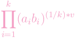
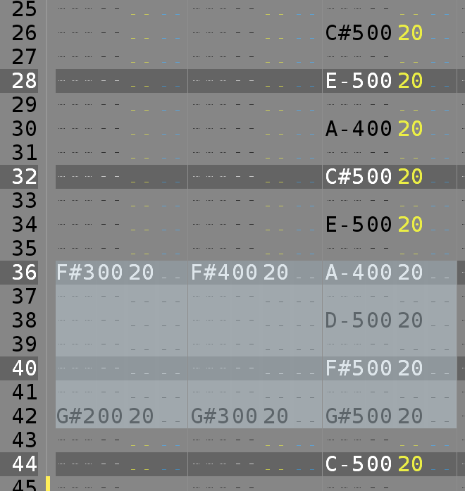
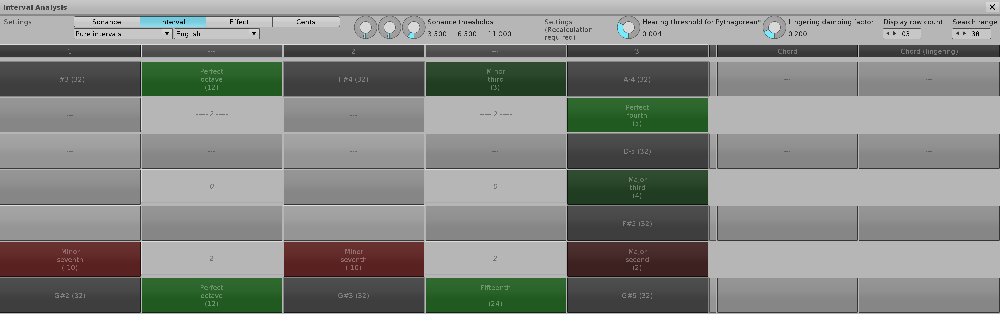
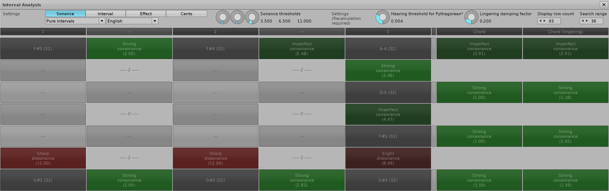
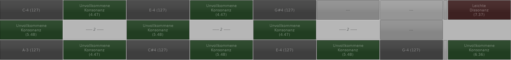

# Introduction

## Overview

This plugin for [renoise](https://www.renoise.com)(tm) is a novice's attempt to approach
the subject of music theory. The motivation is to provide an aid to compensate for lack
of ear training or musical education in general and to speed up learning.

The main features, which are implemented as different views, are
- Determination of the **interval** of two notes for intervals between 0 and 24
  halftones of the twelve-tone system
- Calculation of a **consonance value**, as described by Werner Brefeld (see references)
- Display an **emotional effect** of these intervals for intervals between 0 and 12
  halftones
- Display of the interval in the unit **cents**

Currently, English and German language are supported.

In addition to the features above, a rudimentary detection of a few counterpoint violations
is available:
- Consecutive fifths
- Consecutive octaves
- Fifth - fourth - fifth 

A violation will be indicated at the bottom of the interval analysis.

Pls. note that the note matrix used to display these features is optimized in a way, that
note lines forming intervals are prioritized, which means, that there might be note lines
left out in favor of other note lines which are more important, as they form intervals.

If note lines are left out, a status bar will indicate this fact. Not all features are
available, if note lines are left out. The calculation of lingering chord consonance values
is not performed. Also, the detection of invalid counterpoint patterns is disabled.

I consider this tool as a beta version. 

## Consonance Value

Roughly explained, the consonance value is an **approximation** to the expected level of
consonance or dissonance, basically calculated by

having a/ b as the frequency ratios, in its lowest terms, either of the pure intervals or
of a chosen tuning, and v as the volume percentage. Volume differences are dissected into
separate chords, as outlined in the references, thus v in this case is the same for each
interval.

The consonance value is calculated separately for each two-tone as well as for each chord.
Concerning the chords, the calculation is performed for the actual chord as well as for a
"virtual" lingering chord, which takes notes previously played into account, at least the
ones for which there are no notes in the respective column of the actual chord. Pls. refer
to the example below for more details. The feature of lingering chords is only available
if no note lines are left out.

## Example

As an example let's assume eight notes selected from the Moonlight Sonata as shown in the
first screenshot from renoise(tm) below. The selection itself does not affect which notes
are considered for the analysis. The position of the edit cursor is taken as reference.
The selection is only for illustrative purposes.

If you start the tool e.g. from the editor position in line 38, the display will be as shown
in the second screenshot. It is highly recommended to assign a keyboard shortcut to the
tool for quick access. The corresponding entry in renoise(tm) can be found under
"Global/Tools/Interval Calculator".

In the upper left corner there is a possibility to switch between the features mentioned
above. In the case of the consonance value (abbreviated as "sonance"), the picture is as
shown in the third screenshot.

Another example concerning the calculation of the consonance value, showing an augmented
triad and the dominant seventh chord:

## A Note about Tuning

Due to the nature of the calculation of the consonance value, the irrational numbers of
the equal temperament cannot be used, therefore the frequency ratios of the pure intervals
are taken instead for the equal temperament.

Furthermore, high values for numerator or denominator concerning the frequency ratio
will cause comparably high consonance values. This mainly affects the Pythagorean tuning.
Following a proposal of Werner Brefeld, a patched Pythagorean tuning, suffixed by "*",
is provided, which takes frequency ratios similar to the original ones, but with lower
terms as long as the deviation is less than a certain hearing threshold, which can be
configured in the settings.

The patched Pythagorean tuning is created using an algorithm described by Frieder
Stolzenburg (see references).

## Settings

The settings are divided into two distinct sections. The left-most section indicates
settings which can be changed on-the-fly, without recalculation (= reopening the tool).

This sections consists of the type of the view, representing the different features
outline above. Furthermore, the tuning and the language can be selected. Pls. note the
limitations concerning tunings (see below). The sonance thresholds are used to control
the colors for displaying the consonance values. The left rotary controls the threshold
between light green for strong consonance and dark green for imperfect consonance, the
rotary in the middle then the threshold to slight dissonance and finally, the right
rotary the threshold to the strong dissonance.

Via the right section the hearing threshold can be configured, as outlined in the tuning
chapter above. Furthermore, the damping factor can be used to fine-tune the calculation
of the lingering chord. The calculation basically calculates a new volume by taking the
original volume times the damping factor to the power of the number of note lines, which
is equal to the distance of the lingering note relative to the actual chord.

Lastly, the right section can also be used to optimize the display of the note matrix by
selecting the maximum number of lines to be displayed as well as the search depth, which
can be used to limit the search range, which might become handy in case of sparsely
distributed note lines.

# Acknowledgements

My special thanks go to Werner Brefeld for his elaboration of the
[consonance value calculation](http://www.brefeld.homepage.t-online.de/konsonanz.html)
(in German only) and his willing and extensive support regarding questions.

Further reference:
>Stolzenburg, Frieder.
>Harmony Perception by Periodicity Detection (2013).
>Journal of Mathematics and Music.
>9.10.1080/17459737.2015.1033024.

# Limitations

- The calculation of consonance value is only an approximation 
- "OFF" notes are not considered calculating the consonance value for lingering chords
- Only one track at a time is considered
- This tool is not intended for professional use - do not use for critical applications
- No guarantee is given for correctness
- Scales are not considered yet
- Specific effects like pitch level, etc. are not considered

# License

[GPL v3](org.bridgi.interval.xrnx/gpl-3.0.md)
