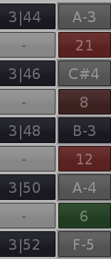

# Introduction

## Overview

This plugin for [renoise](https://www.renoise.com)(tm), which is a [music tracker](https://en.wikipedia.org/wiki/Music_tracker),   
- calculates the **consonance value** as described by Werner Brefeld (see references)
- determines the **interval** of dyads for up to 24 halftones of the twelve-tone system
- displays **emotional effects** for intervals between 0 and 12 halftones
- calculates **cents** for intervals

The main design objectives for this plugin are to aid musical composition training in
general as well as to compensate for lack of ear training.

Currently, English and German languages are supported.

In addition to the features above, a rudimentary detection of a few counterpoint violations
is available and will be indicated in the status bar at the bottom of the analysis window.
- Consecutive fifths
- Consecutive octaves
- Fifth - fourth - fifth

## Example use cases

- Checking for unwanted dissonances in a composition 
- Training of musical composition
- Optimizing a synthesizer settings like tuning, etc.

Concerning the latter, assuming the arbitrary notes A-3, C#-4, B-3, A-4 and F-5,
the consonance values for equal temperament would be

Switching from equal temperament to Kirnberger III tuning on F, the consonance values
would be

The consonance value for A-4 to F-5 were significantly improved. 

## Consonance Value

Roughly explained, the consonance value is an **approximation** to the expected level of
consonance or dissonance, basically calculated by

having a/ b as the frequency ratios, in its lowest terms, either of the pure intervals or
of a chosen tuning, and v as the volume percentage. Volume differences are dissected into
separate chords, as outlined in the references, thus v in this case is the same for each
interval.

The consonance value is calculated separately for each two-tone as well as for each chord.
Concerning the chords, the calculation is performed for the actual chord as well as for a
"virtual" lingering chord, which takes notes previously played into account, at least the
ones for which there are no notes in the respective column of the actual chord. Pls. refer
to the example below for more details. The feature of lingering chords is only available
if no note lines are left out.

## Example

As an example let's assume eight notes selected from the Moonlight Sonata as shown in the
first screenshot from renoise(tm) below. The selection itself does not affect which notes
are considered for the analysis. The position of the edit cursor is taken as reference.
The selection is only for illustrative purposes.

If you start the tool e.g. from the editor position in line 38, the display will be as shown
in the second screenshot. It is highly recommended to assign a keyboard shortcut to the
tool for quick access. The corresponding entry in renoise(tm) can be found under
"Global/Tools/Interval Calculator".

In the upper left corner there is a possibility to switch between the features mentioned
above. In the case of the consonance value (abbreviated as "sonance"), the picture is as
shown in the third screenshot.

Another example concerning the calculation of the consonance value, showing an augmented
triad and the dominant seventh chord:

Yet another example concerning the calculation of the consonance value, this time for the
Pythagorean tuning on D, showing the imperfect fifth or wolf fifth with a significantly
higher dissonance of 18.17 instead of 2.45.

## A Note about Tuning

Due to the nature of the calculation of the consonance value, the irrational numbers of
the equal temperament cannot be used, therefore the frequency ratios are approximated
as described by Frieder Stolzenburg (see references). The hearing threshold, which can
be configured in the settings, can be used to fine-tune the approximation.

For the Pythagorean tuning the same approximation is used, based on frequencies derived
from the pitch level and the tuning note. The hearing threshold is also considered when
calculating the ratios.

The pure interval tuning is not a tuning, of course, and does not take anything into
account, no pitch, no tuning note, no hearing threshold. 

## Views

| View      | Purpose  | Lines might be omitted                                          | Limitations                                                                    | Approximate max. size (4k, 200% scaling) |
|-----------|----------|-----------------------------------------------------------------|--------------------------------------------------------------------------------|------------------------------------------|
| Condensed | Excerpt  | Yes (prioritizing having at least one interval for each column) | If lines omitted: Counterpoint, effect display, lingering chords not available | 12 note columns x 8 rows                 |
| Compact   | Overview | No                                                              | None                                                                           | 24 note columns x 24 rows                |

As I have no idea how to get either the scaling factor or the current window size and it's not possible to set relative
sizes on top elements, the hard-coded sizes are best-effort estimations. If you experience issues, pls. let me know. 

## Settings

The fist setting is the type of the view, representing the different features outline
above. Furthermore, the tuning, the tuning note and the language can be selected.
Pls. note the  limitations concerning tunings (see below). The sonance thresholds are
used to control the colors for displaying the consonance values. The left rotary controls
the threshold between light green for strong consonance and dark green for imperfect
consonance, the rotary in the middle then the threshold to slight dissonance and finally,
the right rotary the threshold to the strong dissonance.

Furthermore, the hearing threshold can be configured, as outlined in the tuning  chapter
above. Furthermore, the damping factor can be used to fine-tune the calculation of the
lingering chord. The calculation basically calculates a new volume by taking the original
volume times the damping factor to the power of the number of note lines, which is equal
to the distance of the lingering note relative to the actual chord. Furthermore, the pitch
level (= Kammerton-Frequenz) can be configured.

Lastly, the rightmost section can also be used to optimize the display of the note matrix
- by selecting the maximum number of lines to be displayed
- as well as the search depth, which can be used to limit the search range, which might
  become handy in case of sparsely distributed note lines
- The number of tracks to be considered

# Acknowledgements

My special thanks go to Werner Brefeld for his elaboration of the
[consonance value calculation](http://www.brefeld.homepage.t-online.de/konsonanz.html)
(in German only) and his willing and extensive support regarding questions, and for
cross-reading this documentation,

and to Frieder Stolzenburg for allowing to use his approximation implementation as a
reference.

>Stolzenburg, Frieder
> 
>[Harmony Perception by Periodicity Detection (March 2015)](https://www.researchgate.net/publication/242331341_Harmony_Perception_by_Periodicity_Detection)
> 
>Journal of Mathematics and Music.
>
>9.10.1080/17459737.2015.1033024.

# Limitations

- The calculation of consonance value is only an approximation 
- "OFF" notes are not considered calculating the consonance value for lingering chords
- No guarantee is given for correctness (not intended for professional/ critical use)
- Specific renoise(tm) effects like pitch level, etc. are not considered

# Download

Download current release at the [release page](https://github.com/ank19/renoise-interval/releases)

# License

[GPL v3](org.bridgi.interval.xrnx/gpl-3.0.md)
